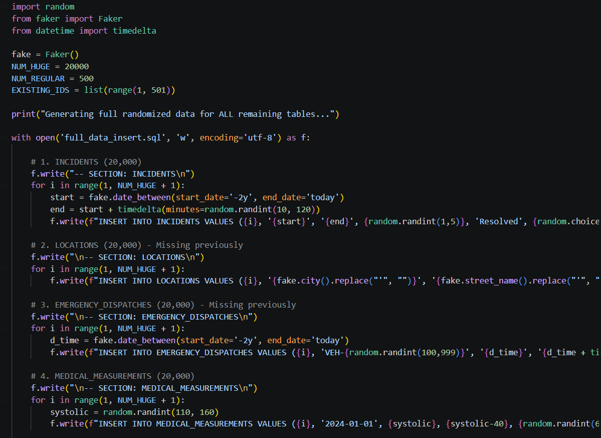
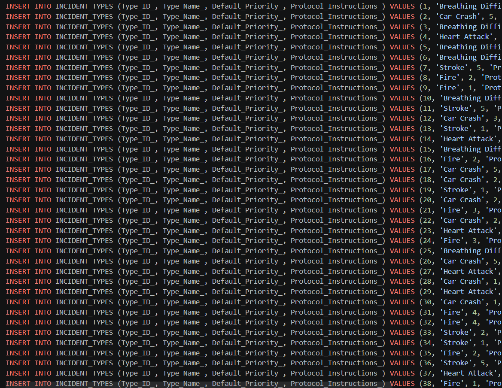
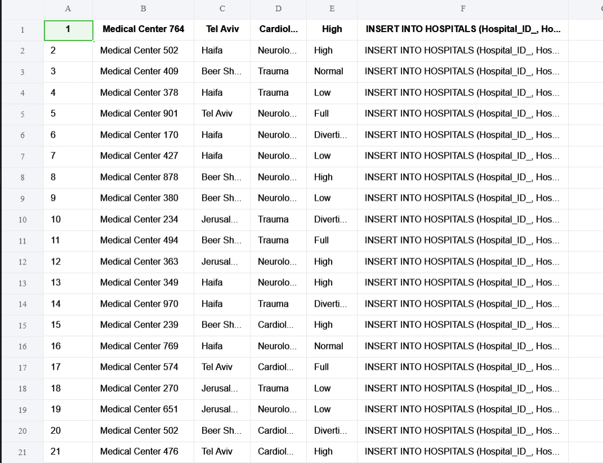

# 🚑 מערכת ניהול אירועים ושיגורים - מד"א (MDA DB Project)

**מיני פרויקט במסגרת קורס בסיסי נתונים**

## 👥 מגישים
* **לידן רובינוב** - 215015900
* **דרור יעקב חי** - 325846319

**מרצה:** הרב יעקב ברזילי הי"ו  
**קישור למאגר ה-GitHub:** [MDA_DB_PROJECT](https://github.com/DrorYakov/MDA_DB_PROJECT)

---

## 📑 תוכן עניינים
1. [מבוא](#מבוא)
2. [מסכי המערכת (AI Studio)](#מסכי-המערכת)
3. [תרשימי ERD ו-DSD](#תרשימי-erd-ו-dsd)
4. [החלטות עיצוב מונחות נתונים](#החלטות-עיצוב)
5. [הכנסת נתונים (DML)](#הכנסת-נתונים)
6. [גיבוי ושחזור נתונים](#גיבוי-ושחזור)

---

## מבוא

**תיאור המערכת והיחידה הנבחרת:** המערכת שפיתחנו מדמה את מערך ניהול האירועים וההזנקות במוקד השליטה של מגן דוד אדום (מד"א). היא מתמקדת ביחידת **השליטה, הבקרה והתיעוד הרפואי בשטח**. 

**הנתונים הנשמרים במערכת:**
המערכת מנהלת מידע מקיף על מחזור החיים של קריאת חירום:
* **קריאות ואירועים (Incidents & Callers):** פרטי המתקשר, סוג האירוע, רמת חומרה, ומיקום מדויק (כולל נ"צ גיאוגרפי).
* **מטופלים (Patients):** פרטים אישיים, היסטוריה רפואית, ואלרגיות.
* **שיגורים (Emergency Dispatches):** ניהול צוותי הרפואה, זמני הזנקה, הגעה לשטח וסיום טיפול.
* **תיעוד קליני בשטח (Measurements & Procedures):** רישום מדדים חיוניים (לחץ דם, דופק, סטורציה) ופעולות רפואיות שבוצעו בשטח (החייאה, מתן חמצן, מתן תרופות).
* **העברות לבתי חולים (Transfer Summaries):** סיכום הטיפול והעברת המטופל לבית חולים ספציפי כולל הערות לרופא המקבל.

**פונקציונליות עיקרית:**
המערכת מאפשרת למוקדנים ולצוותי הרפואה:
1. פתיחת אירוע חדש בזמן אמת וסיווגו.
2. ניטור סטאטוס של כלל האירועים הפעילים בגזרה.
3. תיעוד רציף של המצב הרפואי של המטופל מרגע ההגעה ועד לפינוי.
4. הפקת דוחות סיכום העברה מסודרים עבור בתי החולים.

---

## 💻 מסכי המערכת

מסכי המערכת נוצרו בעזרת כלי AI כדי להמחיש את ממשק המשתמש (UI) של המוקדן והצוות הרפואי.

🔗 **קישור לאתר ב-AI STUDIO:** 'https://ai.studio/apps/64ec0f00-3fc3-4032-9eda-76dc68e13f70'
### 1. דשבורד אירועים פעילים (Active Incidents)
תצוגה מרכזית למוקדן המציגה את כל האירועים הפעילים, זמן שחלף, צוותים משוגרים וסטטוס (קריטי/יציב).

### 2. פתיחת אירוע חדש (New Incident)
טופס הזנת נתונים ראשוניים מקריאת החירום - הזנת פרטי מתקשר וקרבתו למטופל.

### 3. מסך מעקב וניטור רפואי (Incident Monitor)
מסך המציג בזמן אמת את פרטי המטופל, מדדים חיוניים (Vitals), אק"ג, ופרטי השיגור של הניידת (MICU).

### 4. דוח העברה לבית חולים (Hospital Transfer Report)
סיכום כלל הפעולות שבוצעו בשטח (CPR, IV, Medication) והכנת הנתונים להעברה לצוות המיון בבית החולים היעד.

---

## 📊 תרשימי ERD ו-DSD

### Entity Relationship Diagram (ERD)
התרשים מציג את הישויות במערכת, התכונות שלהן והקשרים ביניהן. 

### Data Structure Diagram (DSD) / מבנה סכמה
הסכמה הלוגית באה לידי ביטוי בקובץ ה-`createTables.sql` הנמצא במאגר. היא כוללת את כל מפתחות ה-PK וה-FK, אילוצי CHECK (כגון וידוא שזמן סיום מאוחר מזמן התחלה, תקינות מדדי לחץ דם, ועוד).

---

## 🛠️ החלטות עיצוב

במהלך תכנון בסיס הנתונים, קיבלנו מספר החלטות משמעותיות:

1. **הפרדה מוחלטת בין מתקשר למטופל (`CALLERS` מול `PATIENTS`):** * *נימוק:* במקרי חירום, לעיתים קרובות המתקשר הוא עובר אורח או בן משפחה ולא המטופל עצמו. הפרדה זו מונעת כפילויות ומאפשרת שמירת שפת האם של המתקשר בנפרד מההיסטוריה הרפואית של המטופל.
2. **טבלאות גישור למדדים וטיפולים (`MEDICAL_MEASUREMENTS` ו-`PROCEDURES_PERFORMED`):** * *נימוק:* פעולות רפואיות ומדדים מקושרים גם לשיגור ספציפי (`Dispatch_ID`) וגם למטופל (`Patient_ID`). תכנון זה תומך באירועים רבי נפגעים (אר"ן) שבהם אמבולנס אחד (שיגור אחד) מעניק טיפול למספר מטופלים שונים באותה זירה.
3. **נרמול טבלת מיקומים (`LOCATIONS`):** * *נימוק:* הפרדנו את פרטי המיקום המדויקים (עיר, רחוב, קואורדינטות) מהאירוע עצמו. זה מאפשר ביצוע שאילתות גיאוגרפיות יעילות יותר, סטטיסטיקות על אזורי סיכון, והתממשקות עתידית למערכות GIS.
4. **שימוש נרחב באילוצי הנתונים (Constraints):**
   * *נימוק:* הוספנו אילוצי `CHECK` קפדניים כגון וידוא שלחץ דם סיסטולי גבוה מהדיאסטולי, אחוז חמצן בין 0 ל-100, וסטטוס בתי חולים ספציפי ('Low', 'Normal', 'Full', 'Diverting'). החלטה זו נועדה להבטיח את שלמות ואמינות הנתונים במערכת קריטית כמו מד"א.

---

## 📝 הכנסת נתונים

להלן שלוש שיטות שבהן השתמשנו להכנסת נתונים (DML) לבסיס הנתונים שלנו:

1. **הכנסה ידנית (Manual INSERTs):** שימוש בשאילתות `INSERT INTO` לטובת הכנסת נתוני ליבה סטטיים (כמו סוגי אירועים, רשימת בתי חולים).
2. **יבוא קבצי CSV:** תוך שימוש ב Excel ליצירת אקראיות.
3. **סקריפט אוטומטי (Mock Data Generation):** בשימוש בסקריפט python שיצרנו.

**צילומי מסך של הכנסת הנתונים:**

---

## 💾 גיבוי ושחזור

תהליך הגיבוי והשחזור של בסיס הנתונים בוצע כדי להבטיח זמינות נתונים במקרה של קריסת מערכת:

**צילום מסך של תהליך ביצוע הגיבוי (Backup):**
 *(יש להחליף בתמונה שלכם)*

**צילום מסך של תהליך שחזור הנתונים (Restore):**
 *(יש להחליף בתמונה שלכם)*
