# 🚑 מערכת ניהול אירועים ושיגורים - מד"א (MDA DB Project)

**מיני פרויקט במסגרת קורס בסיסי נתונים**

## 👥 מגישים
* **לידן רובינוב** - 215015900
* **דרור יעקב חי** - 325846319

**מרצה:** הרב יעקב ברזילי הי"ו  
**קישור למאגר ה-GitHub:** [MDA_DB_PROJECT](https://github.com/DrorYakov/MDA_DB_PROJECT)

---

## 📑 תוכן עניינים
1. [מבוא](#מבוא)
2. [מסכי המערכת (AI Studio)](#מסכי-המערכת)
3. [תרשימי ERD ו-DSD](#תרשימי-erd-ו-dsd)
4. [החלטות עיצוב מונחות נתונים](#החלטות-עיצוב)
5. [הכנסת נתונים (DML)](#הכנסת-נתונים)
6. [גיבוי ושחזור נתונים](#גיבוי-ושחזור)
7. [שלב ב׳: שאילתות ואילוצים](#שלב-ב-שאילתות-ואילוצים)

---

## מבוא

**תיאור המערכת והיחידה הנבחרת:** המערכת שפיתחנו מדמה את מערך ניהול האירועים וההזנקות במוקד השליטה של מגן דוד אדום (מד"א). היא מתמקדת ביחידת **השליטה, הבקרה והתיעוד הרפואי בשטח**. 

**הנתונים הנשמרים במערכת:**
המערכת מנהלת מידע מקיף על מחזור החיים של קריאת חירום:
* **קריאות ואירועים (Incidents & Callers):** פרטי המתקשר, סוג האירוע, רמת חומרה, ומיקום מדויק (כולל נ"צ גיאוגרפי).
* **מטופלים (Patients):** פרטים אישיים, היסטוריה רפואית, ואלרגיות.
* **שיגורים (Emergency Dispatches):** ניהול צוותי הרפואה, זמני הזנקה, הגעה לשטח וסיום טיפול.
* **תיעוד קליני בשטח (Measurements & Procedures):** רישום מדדים חיוניים (לחץ דם, דופק, סטורציה) ופעולות רפואיות שבוצעו בשטח (החייאה, מתן חמצן, מתן תרופות).
* **העברות לבתי חולים (Transfer Summaries):** סיכום הטיפול והעברת המטופל לבית חולים ספציפי כולל הערות לרופא המקבל.

**פונקציונליות עיקרית:**
המערכת מאפשרת למוקדנים ולצוותי הרפואה:
1. פתיחת אירוע חדש בזמן אמת וסיווגו.
2. ניטור סטאטוס של כלל האירועים הפעילים בגזרה.
3. תיעוד רציף של המצב הרפואי של המטופל מרגע ההגעה ועד לפינוי.
4. הפקת דוחות סיכום העברה מסודרים עבור בתי החולים.

---

## מסכי המערכת

מסכי המערכת נוצרו בעזרת כלי AI כדי להמחיש את ממשק המשתמש (UI) של המוקדן והצוות הרפואי.

🔗 **קישור לאתר ב-AI STUDIO:** 'https://ai.studio/apps/64ec0f00-3fc3-4032-9eda-76dc68e13f70'
### 1. דשבורד אירועים פעילים (Active Incidents)
תצוגה מרכזית למוקדן המציגה את כל האירועים הפעילים, זמן שחלף, צוותים משוגרים וסטטוס (קריטי/יציב).


### 2. פתיחת אירוע חדש (New Incident)
טופס הזנת נתונים ראשוניים מקריאת החירום - הזנת פרטי מתקשר וקרבתו למטופל.


### 3. מסך מעקב וניטור רפואי (Incident Monitor)
מסך המציג בזמן אמת את פרטי המטופל, מדדים חיוניים (Vitals), אק"ג, ופרטי השיגור של הניידת (MICU).


### 4. דוח העברה לבית חולים (Hospital Transfer Report)
סיכום כלל הפעולות שבוצעו בשטח (CPR, IV, Medication) והכנת הנתונים להעברה לצוות המיון בבית החולים היעד.


---

## תרשימי ERD ו-DSD

### Entity Relationship Diagram (ERD)
התרשים מציג את הישויות במערכת, התכונות שלהן והקשרים ביניהן. 


### Data Structure Diagram (DSD) / מבנה סכמה

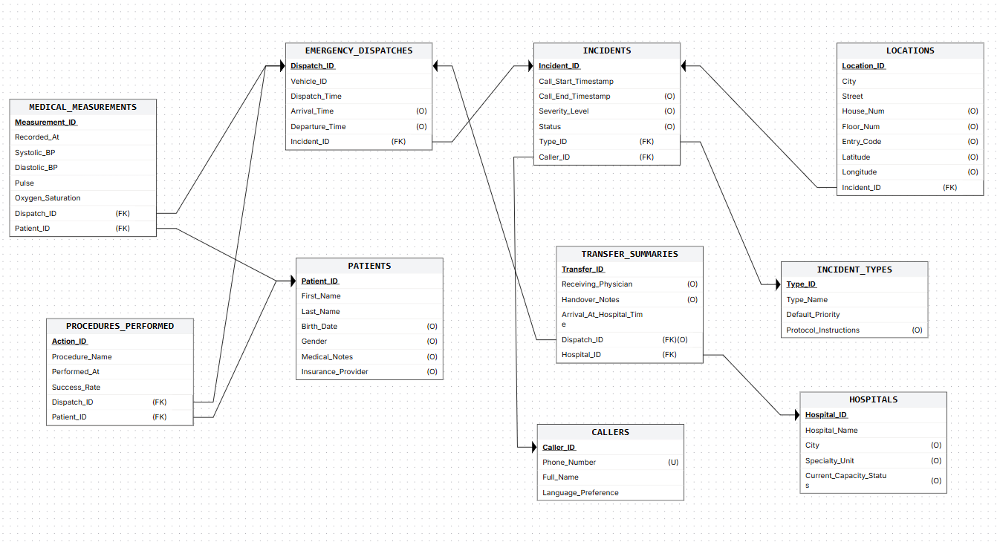

---

## החלטות עיצוב

במהלך תכנון בסיס הנתונים, קיבלנו מספר החלטות משמעותיות:

1. **הפרדה מוחלטת בין מתקשר למטופל (`CALLERS` מול `PATIENTS`):** * *נימוק:* במקרי חירום, לעיתים קרובות המתקשר הוא עובר אורח או בן משפחה ולא המטופל עצמו. הפרדה זו מונעת כפילויות ומאפשרת שמירת שפת האם של המתקשר בנפרד מההיסטוריה הרפואית של המטופל.
2. **טבלאות גישור למדדים וטיפולים (`MEDICAL_MEASUREMENTS` ו-`PROCEDURES_PERFORMED`):** * *נימוק:* פעולות רפואיות ומדדים מקושרים גם לשיגור ספציפי (`Dispatch_ID`) וגם למטופל (`Patient_ID`). תכנון זה תומך באירועים רבי נפגעים (אר"ן) שבהם אמבולנס אחד (שיגור אחד) מעניק טיפול למספר מטופלים שונים באותה זירה.
3. **נרמול טבלת מיקומים (`LOCATIONS`):** * *נימוק:* הפרדנו את פרטי המיקום המדויקים (עיר, רחוב, קואורדינטות) מהאירוע עצמו. זה מאפשר ביצוע שאילתות גיאוגרפיות יעילות יותר, סטטיסטיקות על אזורי סיכון, והתממשקות עתידית למערכות GIS.
4. **שימוש נרחב באילוצי הנתונים (Constraints):**
   * *נימוק:* הוספנו אילוצי `CHECK` קפדניים כגון וידוא שלחץ דם סיסטולי גבוה מהדיאסטולי, אחוז חמצן בין 0 ל-100, וסטטוס בתי חולים ספציפי ('Low', 'Normal', 'Full', 'Diverting'). החלטה זו נועדה להבטיח את שלמות ואמינות הנתונים במערכת קריטית כמו מד"א.

---

##  הכנסת נתונים

להלן שלוש שיטות שבהן השתמשנו להכנסת נתונים (DML) לבסיס הנתונים שלנו:

1. **הכנסה ידנית (Manual INSERTs):** שימוש בשאילתות `INSERT INTO` לטובת הכנסת נתוני ליבה סטטיים (כמו סוגי אירועים, רשימת בתי חולים).
2. **יבוא קבצי CSV:** תוך שימוש ב Excel ליצירת אקראיות.
3. **סקריפט אוטומטי (Mock Data Generation):** בשימוש בסקריפט python שיצרנו.

**צילומי מסך של הכנסת הנתונים:**
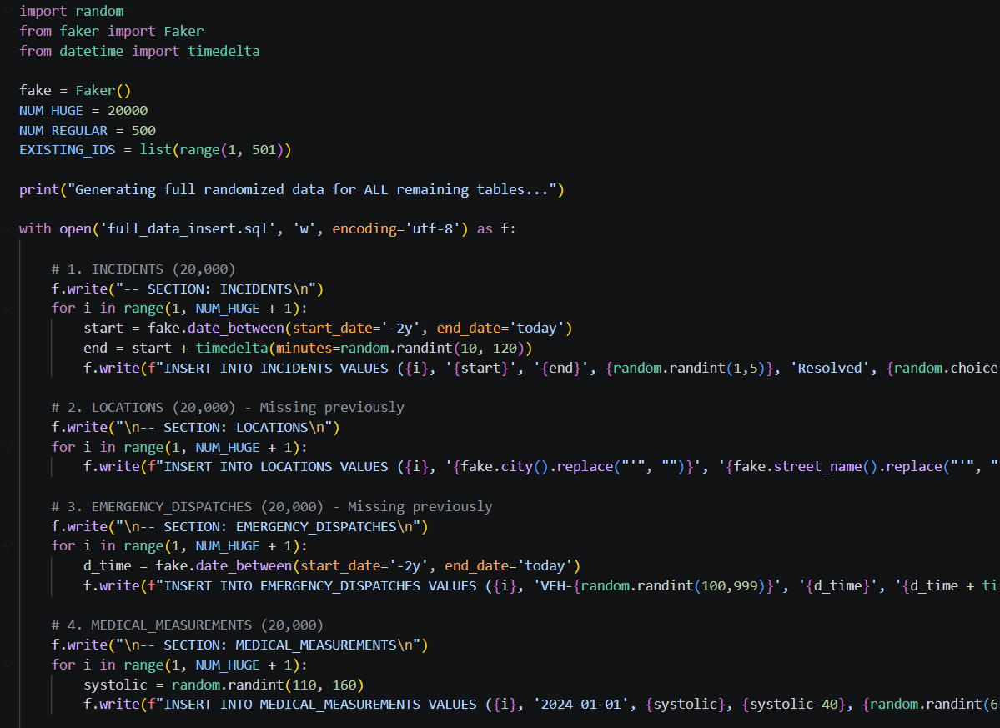
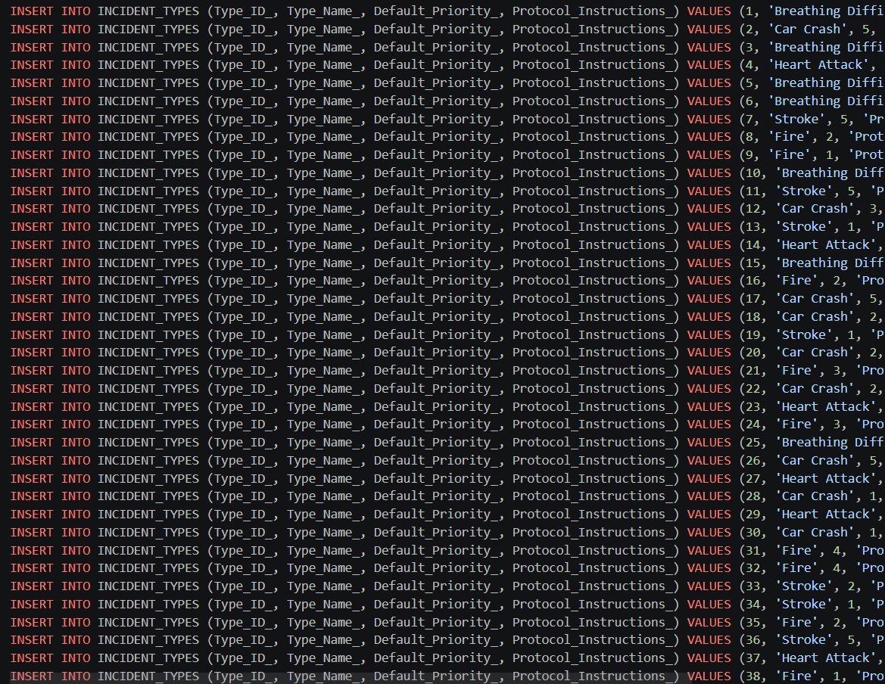
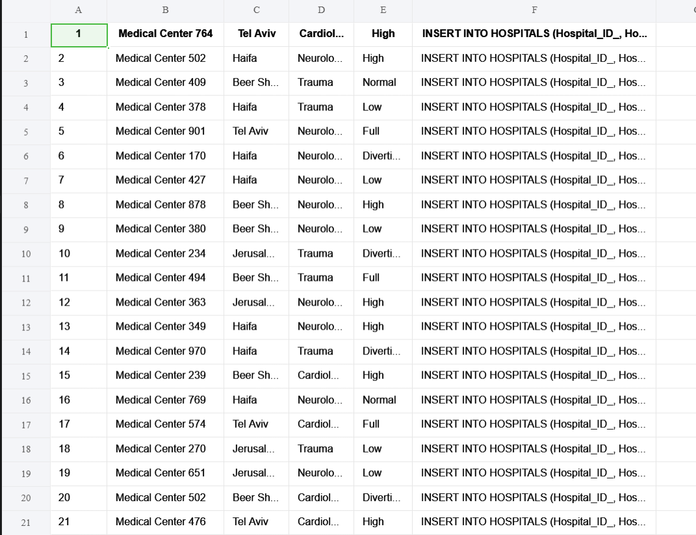

---

## גיבוי ושחזור

תהליך הגיבוי והשחזור של בסיס הנתונים בוצע כדי להבטיח זמינות נתונים במקרה של קריסת מערכת:

**צילום מסך של תהליך ביצוע הגיבוי (Backup):**
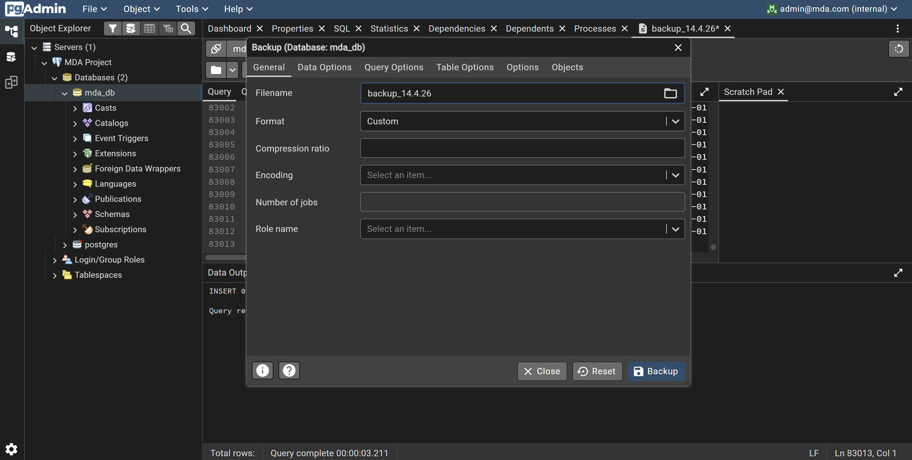

**צילום מסך של תהליך שחזור הנתונים (Restore):**
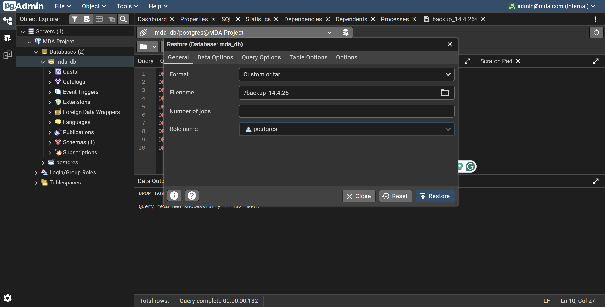

---

## שלב ב׳: שאילתות ואילוצים

בשלב זה בוצע תשאול של בסיס הנתונים, הוגדרו אילוצים ואינדקסים, ונבדקו פעולות `ROLLBACK` ו-`COMMIT`.

### קבצי ההגשה (תיקיית `שלב ב`)

- **`Stage_2/Queries.sql`**: שאילתות `DELETE` ו-`UPDATE`
- **`Stage_2/query_1..query_8/query.sql`**: שאילתות `SELECT` (כולל 4 כפולות בשתי צורות)
- **`Stage_2/Constraints.sql`**: הוספת 3 אילוצים באמצעות `ALTER TABLE`
- **`Stage_2/RollbackCommit.sql`**: דוגמת `ROLLBACK` (ודוגמת `COMMIT` תתווסף)
- **`Stage_2/Index.sql`**: הוספת 3 אינדקסים + בדיקת זמני ריצה לפני/אחרי
- **`backup2`**: קובץ גיבוי מעודכן לאחר השינויים

### שאילתות SELECT (8 סה״כ)

דרישות כלליות: שאילתות לא טריוויאליות, צירוף מידע ממספר טבלאות, שימוש ב-`GROUP BY`, `ORDER BY`, תתי-שאילתות/קינון, ושימוש בשדות תאריך (עדיפות לפירוק ליום/חודש/שנה). תוצאת כל שאילתה כוללת **יותר מ-2 עמודות** ומתאימה להצגה במסכים.

#### 4 שאילתות SELECT כפולות (אותה תוצאה בשתי צורות) + הסבר יעילות

##### SELECT כפולה 1 — תיאור בעברית

- **תיאור**: דוח ניהולי המציג **עומס אירועים חמורים לפי עיר**: עבור כל עיר מוצגים מספר האירועים החמורים, ממוצע חומרה, ומיון לפי כמות אירועים.
- **שאילתה – צורה א׳**:
```sql
SELECT L.City_, COUNT(I.Incident_ID_) AS Total_Severe_Incidents, AVG(I.Severity_Level_) AS Avg_Severity
FROM INCIDENTS I
JOIN LOCATIONS L ON I.Incident_ID_ = L.Incident_ID_
WHERE I.Severity_Level_ >= 3
GROUP BY L.City_
HAVING COUNT(I.Incident_ID_) > 5
ORDER BY Total_Severe_Incidents DESC;
```
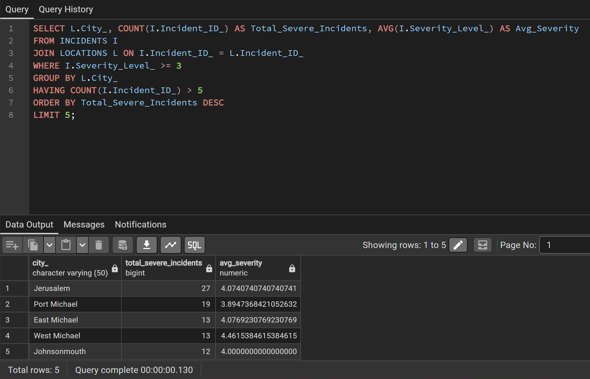

- **שאילתה – צורה ב׳**:
```sql
SELECT City_, COUNT(Location_ID_) AS Total_Severe_Incidents
FROM LOCATIONS
WHERE Incident_ID_ IN (SELECT Incident_ID_ FROM INCIDENTS WHERE Severity_Level_ >= 3)
GROUP BY City_
HAVING COUNT(Location_ID_) > 5
ORDER BY Total_Severe_Incidents DESC;
```
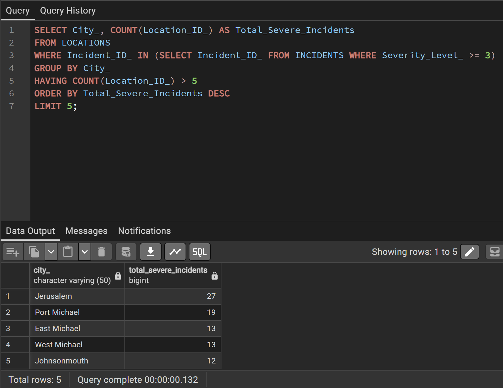

- **הבדלים ויעילות**:
  - **מה ההבדל בין צורה א׳ לצורה ב׳**: צורה א׳ משתמשת ב-`JOIN` ומחזירה גם ממוצע חומרה; צורה ב׳ משתמשת בתת-שאילתה עם `IN` ומבצעת ספירה על טבלת `LOCATIONS`.
  - **מה יותר יעיל ולמה**: ברוב המקרים צורה א׳ יעילה יותר כי האופטימייזר יכול לבחור תכנית חיבור יעילה (`Hash Join`/`Merge Join`) ולבצע אגרגציה לאחר החיבור. בצורה ב׳ יש תת-שאילתה שיכולה להוביל ל־`Subquery Scan`/חומרה של `IN` (תלוי DB), ולעיתים פחות מנצלת אינדקסים על צירוף.

##### SELECT כפולה 2 — תיאור בעברית

- **תיאור**: דוח קליני המציג **מטופלים עם דופק חריג (Pulse > 120) במהלך השנה הנוכחית** כולל שם מלא וספק ביטוח.
- **שאילתה – צורה א׳**:
```sql
SELECT P.First_Name_ || ' ' || P.Last_Name_ AS Full_Name, P.Insurance_Provider_
FROM PATIENTS P
JOIN MEDICAL_MEASUREMENTS M ON P.Patient_ID_ = M.Patient_ID_
WHERE M.Pulse_ > 120 
  AND EXTRACT(YEAR FROM M.Recorded_At_) = EXTRACT(YEAR FROM CURRENT_DATE)
GROUP BY P.First_Name_, P.Last_Name_, P.Insurance_Provider_;
```
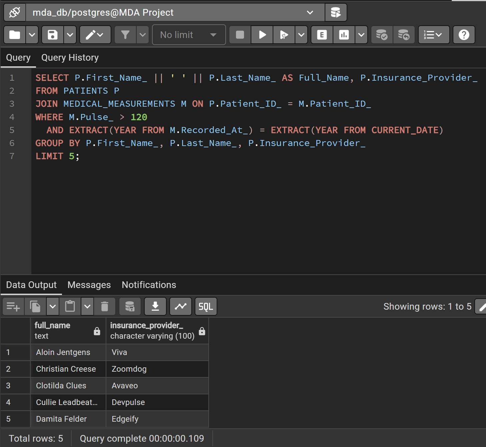

- **שאילתה – צורה ב׳**:
```sql
SELECT First_Name_ || ' ' || Last_Name_ AS Full_Name, Insurance_Provider_
FROM PATIENTS P
WHERE EXISTS (
    SELECT 1 
    FROM MEDICAL_MEASUREMENTS M 
    WHERE M.Patient_ID_ = P.Patient_ID_ 
      AND M.Pulse_ > 120 
      AND EXTRACT(YEAR FROM M.Recorded_At_) = EXTRACT(YEAR FROM CURRENT_DATE)
)
GROUP BY P.First_Name_, P.Last_Name_, P.Insurance_Provider_;
```
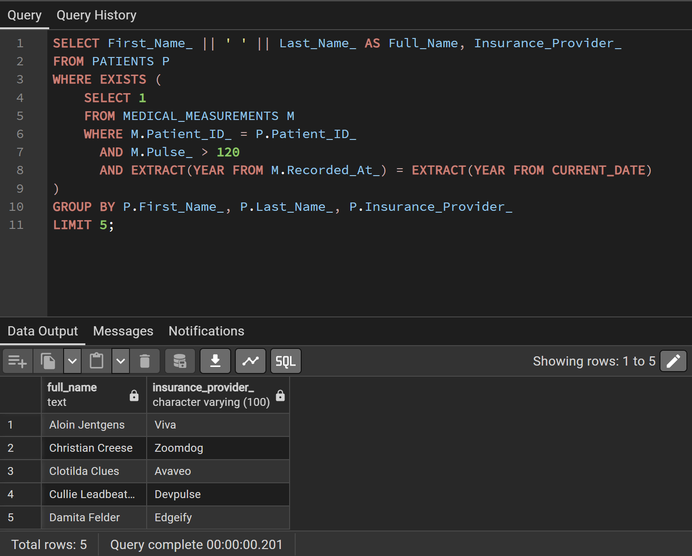

- **הבדלים ויעילות**:
  - **הבדל**: צורה א׳ עושה `JOIN` ישיר על טבלת המדדים ועלולה להחזיר/לעבד ריבוי שורות לכל מטופל; צורה ב׳ משתמשת ב-`EXISTS` ובודקת רק קיום מדד מתאים (אפשר “לעצור מוקדם”).
  - **יעילות**: לרוב `EXISTS` יעיל יותר כשהמטרה היא “יש/אין” כי ניתן לבצע `Semi-Join` ולצמצם סריקות. `JOIN` מתאים אם רוצים אגרגציות/חישובים על המדדים עצמם.

##### SELECT כפולה 3 — תיאור בעברית

- **תיאור**: דוח למשרד הבריאות: **בתי חולים שלא קלטו אף מטופל בשנה הנוכחית** (לא הופיעו ב־`TRANSFER_SUMMARIES`).
- **שאילתה – צורה א׳**:
```sql
SELECT H.Hospital_Name_, H.City_
FROM HOSPITALS H
LEFT JOIN TRANSFER_SUMMARIES TS 
  ON H.Hospital_ID_ = TS.Hospital_ID_ 
  AND EXTRACT(YEAR FROM TS.Arrival_At_Hospital_Time_) = EXTRACT(YEAR FROM CURRENT_DATE)
WHERE TS.Transfer_ID_ IS NULL;
```
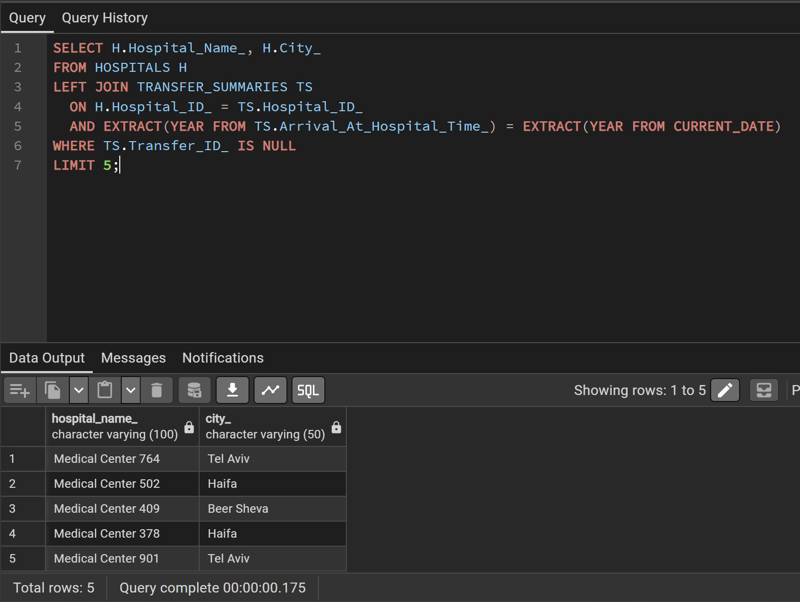

- **שאילתה – צורה ב׳**:
```sql
SELECT Hospital_Name_, City_
FROM HOSPITALS
WHERE Hospital_ID_ NOT IN (
    SELECT Hospital_ID_ 
    FROM TRANSFER_SUMMARIES 
    WHERE EXTRACT(YEAR FROM Arrival_At_Hospital_Time_) = EXTRACT(YEAR FROM CURRENT_DATE)
);
```
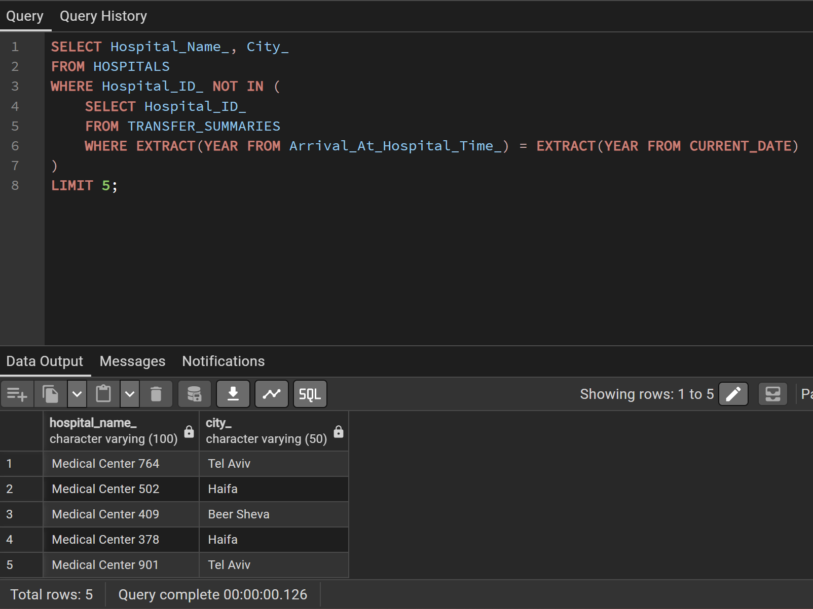

- **הבדלים ויעילות**:
  - **הבדל**: צורה א׳ משתמשת ב־`LEFT JOIN ... IS NULL` (אנטי-ג'וין). צורה ב׳ משתמשת ב־`NOT IN` עם תת-שאילתה.
  - **יעילות**: בדרך כלל `LEFT JOIN ... IS NULL` או `NOT EXISTS` עדיפים על `NOT IN` (במיוחד כשיש `NULL`s בתת-שאילתה שעלולים לשנות לוגיקה). האופטימייזר לרוב ממיר `LEFT JOIN ... IS NULL` לאנטי-ג'וין יעיל.

##### SELECT כפולה 4 — תיאור בעברית

- **תיאור**: דוח למוקדן המציג **כמות קריאות לכל מדווח לפי שנה וחודש**, כולל שם מדווח וטלפון, ומסנן מדווחים עם יותר מ־2 קריאות בחודש.
- **שאילתה – צורה א׳**:
```sql
SELECT C.Full_Name_, C.Phone_Number_, 
       EXTRACT(YEAR FROM I.Call_Start_Timestamp_) AS Call_Year, 
       EXTRACT(MONTH FROM I.Call_Start_Timestamp_) AS Call_Month,
       COUNT(I.Incident_ID_) AS Total_Calls
FROM CALLERS C
JOIN INCIDENTS I ON C.Caller_ID_ = I.Caller_ID_
GROUP BY C.Full_Name_, C.Phone_Number_, Call_Year, Call_Month
HAVING COUNT(I.Incident_ID_) > 2;
```
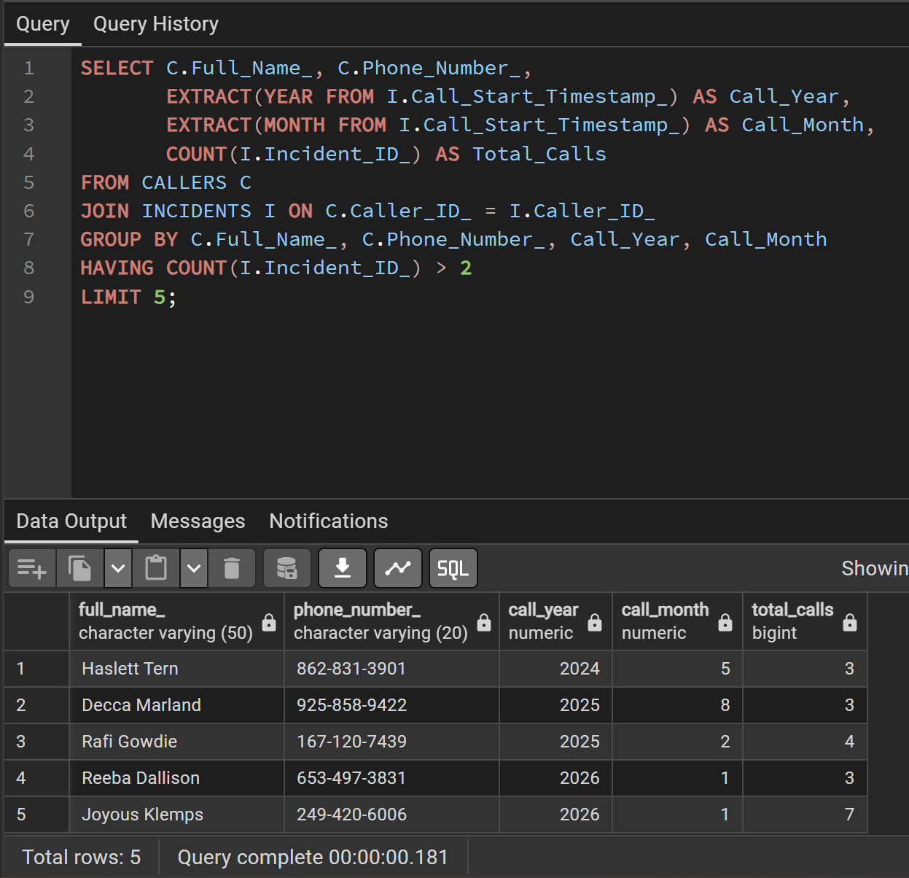

- **שאילתה – צורה ב׳**:
```sql
SELECT Full_Name_, Phone_Number_, Call_Year, Call_Month, Total_Calls
FROM (
    SELECT C.Full_Name_, C.Phone_Number_, 
           EXTRACT(YEAR FROM I.Call_Start_Timestamp_) AS Call_Year, 
           EXTRACT(MONTH FROM I.Call_Start_Timestamp_) AS Call_Month,
           COUNT(I.Incident_ID_) AS Total_Calls
    FROM CALLERS C
    JOIN INCIDENTS I ON C.Caller_ID_ = I.Caller_ID_
    GROUP BY C.Full_Name_, C.Phone_Number_, EXTRACT(YEAR FROM I.Call_Start_Timestamp_), EXTRACT(MONTH FROM I.Call_Start_Timestamp_)
) AS MonthlyStats
WHERE Total_Calls > 2;
```
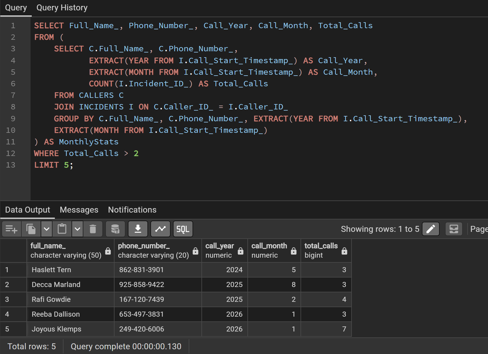

- **הבדלים ויעילות**:
  - **הבדל**: צורה א׳ מסננת עם `HAVING` על האגרגציה. צורה ב׳ בונה טבלה נגזרת (Derived Table) ואז מסננת ב־`WHERE`.
  - **יעילות**: לרוב האופטימייזר מפיק תכנית דומה, אבל צורה א׳ ישירה וברורה יותר; צורה ב׳ שימושית כשצריך להמשיך לבצע סינונים/חיבורים נוספים על התוצאה האגרגטיבית.

#### 4 שאילתות SELECT נוספות (ללא כפילות)

##### SELECT 5 — תיאור בעברית

- **תיאור**: מסך פרמדיק/רופא: **סיכום מדדים קריטיים לפי מטופל בחודש הנוכחי** (סטורציה מינימלית, דופק מקסימלי) כולל חישוב גיל, סינון מטופלים עם סטורציה מתחת ל־90 ומיון לפי הנמוכה ביותר.
- **שאילתה**:
```sql
SELECT 
    P.First_Name_ || ' ' || P.Last_Name_ AS Patient_Name,
    EXTRACT(YEAR FROM CURRENT_DATE) - EXTRACT(YEAR FROM P.Birth_Date_) AS Patient_Age,
    MIN(M.Oxygen_Saturation_) AS Lowest_Oxygen,
    MAX(M.Pulse_) AS Highest_Pulse
FROM PATIENTS P
JOIN MEDICAL_MEASUREMENTS M ON P.Patient_ID_ = M.Patient_ID_
WHERE EXTRACT(MONTH FROM M.Recorded_At_) = EXTRACT(MONTH FROM CURRENT_DATE)
GROUP BY P.First_Name_, P.Last_Name_, P.Birth_Date_
HAVING MIN(M.Oxygen_Saturation_) < 90
ORDER BY Lowest_Oxygen ASC;
```
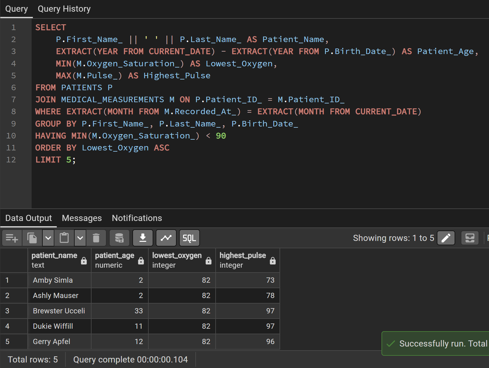


##### SELECT 6 — תיאור בעברית

- **תיאור**: מסך משגר/מנהל: **“מיקומים חמים” של אירועים פעילים** לפי עיר ורחוב, כולל כמות אירועים פעילים, חומרה מקסימלית, וזמן הקריאה הוותיק ביותר באזור.
- **שאילתה**:
```sql
SELECT 
    L.City_,
    L.Street_,
    COUNT(I.Incident_ID_) AS Active_Incidents,
    MAX(I.Severity_Level_) AS Highest_Severity,
    MIN(I.Call_Start_Timestamp_) AS Oldest_Call_Time
FROM INCIDENTS I
JOIN LOCATIONS L ON I.Incident_ID_ = L.Incident_ID_
WHERE I.Status_ IN ('Pending', 'Dispatched', 'On Scene')
GROUP BY L.City_, L.Street_
HAVING COUNT(I.Incident_ID_) >= 2
ORDER BY Highest_Severity DESC, Active_Incidents DESC;
```
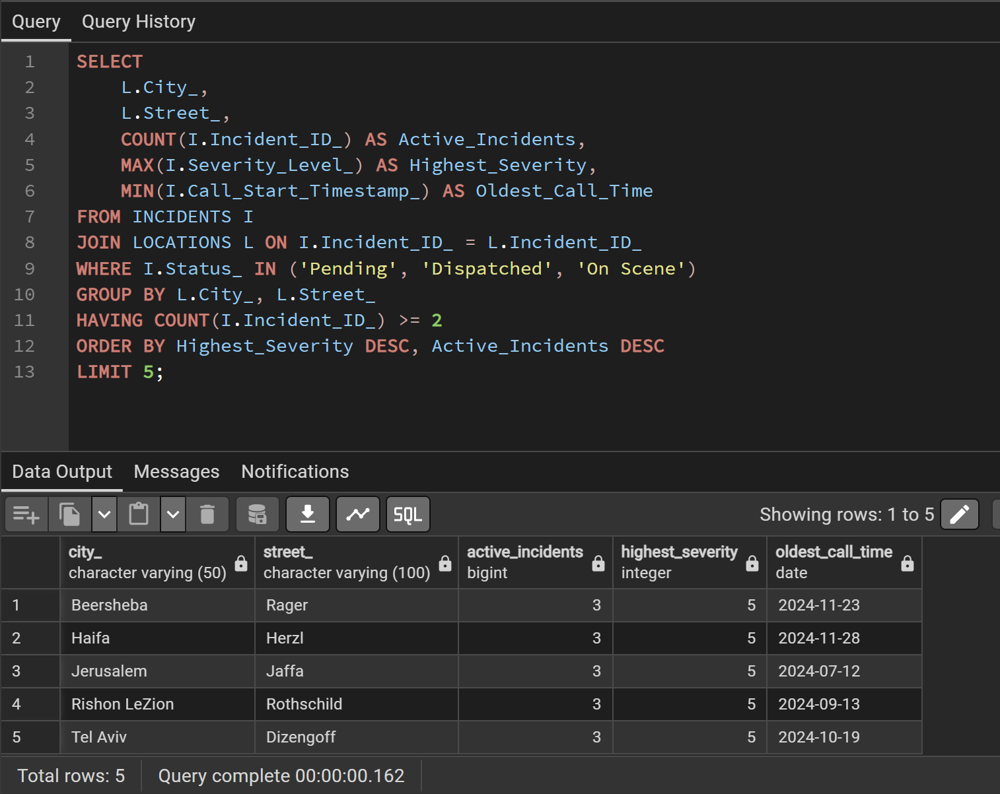


##### SELECT 7 — תיאור בעברית

- **תיאור**: מסך מנהל רפואי: **עומס על רופאים מקבלים בבתי חולים** בשנה הנוכחית, כולל בית חולים/עיר/שם רופא, מספר מטופלים שקיבל ותאריך הגעה אחרון.
- **שאילתה**:
```sql
SELECT 
    H.Hospital_Name_,
    H.City_,
    TS.Receiving_Physician_ AS Doctor_Name,
    COUNT(TS.Transfer_ID_) AS Total_Patients_Received,
    MAX(TS.Arrival_At_Hospital_Time_) AS Last_Transfer_Date
FROM HOSPITALS H
JOIN TRANSFER_SUMMARIES TS ON H.Hospital_ID_ = TS.Hospital_ID_
WHERE EXTRACT(YEAR FROM TS.Arrival_At_Hospital_Time_) = EXTRACT(YEAR FROM CURRENT_DATE)
GROUP BY H.Hospital_Name_, H.City_, TS.Receiving_Physician_
HAVING COUNT(TS.Transfer_ID_) > 5
ORDER BY Total_Patients_Received DESC;
```
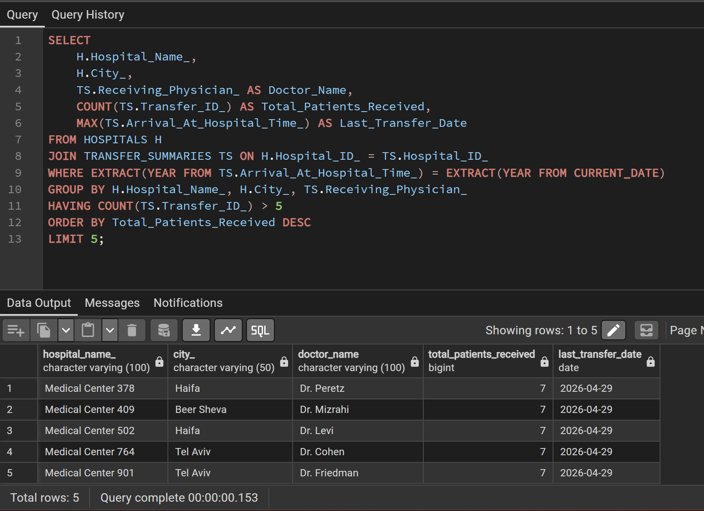


##### SELECT 8 — תיאור בעברית

- **תיאור**: דוח איכות: **פרוצדורות עם הצלחה גבוהה** כולל שם פרוצדורה, דירוג הצלחה, שם מטופל וחישוב גיל בזמן ביצוע הפרוצדורה, ומיון לפי גיל.
- **שאילתה**:
```sql
SELECT PP.Procedure_Name_, PP.Success_Rate_, P.First_Name_, P.Last_Name_,
       EXTRACT(YEAR FROM PP.Performed_At_) - EXTRACT(YEAR FROM P.Birth_Date_) AS Patient_Age_At_Procedure
FROM PROCEDURES_PERFORMED PP
JOIN PATIENTS P ON PP.Patient_ID_ = P.Patient_ID_
WHERE PP.Success_Rate_ = 'High'
ORDER BY Patient_Age_At_Procedure ASC;
```
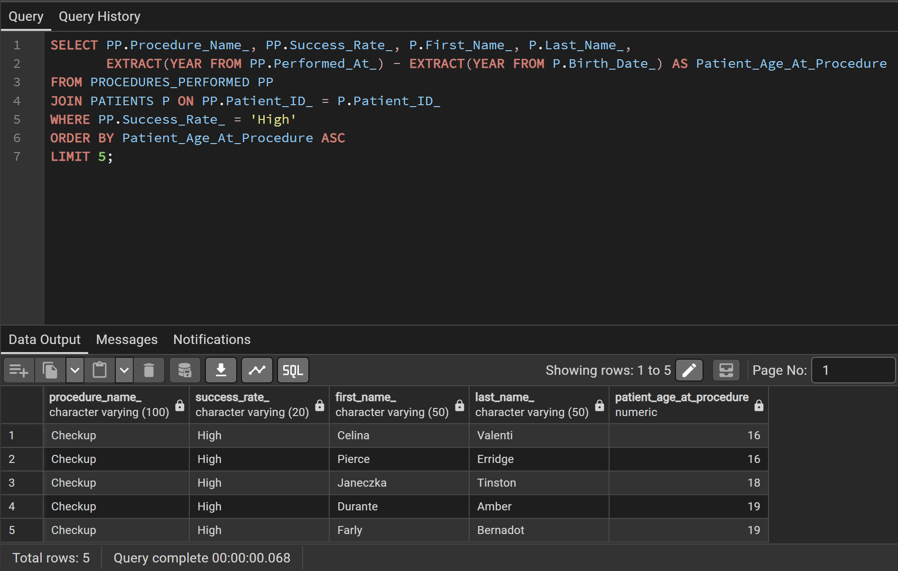


### שאילתות DELETE (3 סה״כ)

> לכל שאילתת `DELETE`: יש לכלול תיאור בעברית + צילום הרצה + צילום מצב בסיס הנתונים **לפני** ו**אחרי**.

#### DELETE 1

- **תיאור**: ארכוב/ניקוי נתונים: מחיקת מדדים רפואיים ישנים מאוד (שנת הקלטה לפני 2014) מטבלת `MEDICAL_MEASUREMENTS`.
- **שאילתה**:
```sql
DELETE FROM MEDICAL_MEASUREMENTS
WHERE EXTRACT(YEAR FROM Recorded_At_) < 2014;
```


#### DELETE 2

- **תיאור**: מחיקת מדווחים (Callers) שאין להם אף אירוע מקושר (ללא היסטוריית דיווח) כדי לשמור על בסיס נתונים נקי.
- **שאילתה**:
```sql
DELETE FROM CALLERS
WHERE Caller_ID_ NOT IN (SELECT DISTINCT Caller_ID_ FROM INCIDENTS);
```
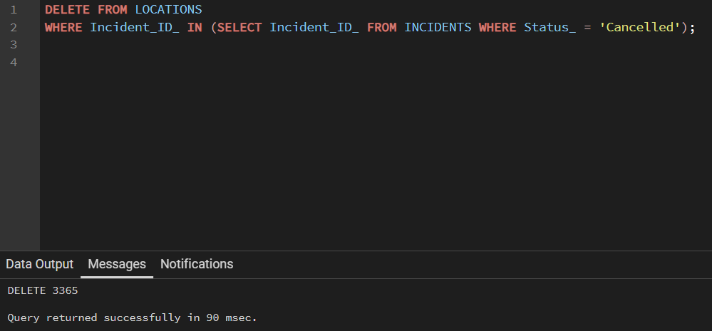
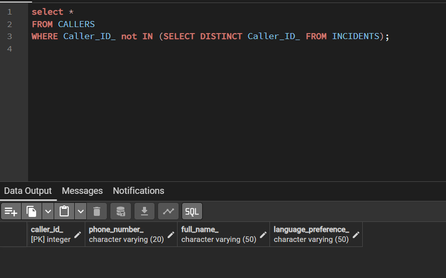

#### DELETE 3

- **תיאור**: מחיקת רשומות מיקום של אירועים שבוטלו (`Cancelled`) כדי להימנע מנתוני מיקום מיותרים שאינם רלוונטיים לתפעול.
- **שאילתה**:
```sql
DELETE FROM LOCATIONS
WHERE Incident_ID_ IN (SELECT Incident_ID_ FROM INCIDENTS WHERE Status_ = 'Cancelled');
```


### שאילתות UPDATE (3 סה״כ)

> לכל שאילתת `UPDATE`: יש לכלול תיאור בעברית + צילום הרצה + צילום מצב בסיס הנתונים **לפני** ו**אחרי**.

#### UPDATE 1

- **תיאור**: עדכון סטטוס עומס בית חולים: אם לבית חולים היו יותר מ־2 פינויים בשנה הנוכחית, הסטטוס שלו מתעדכן ל־`High` (מבוסס `TRANSFER_SUMMARIES`).
- **שאילתה**:
```sql
UPDATE HOSPITALS
SET Current_Capacity_Status_ = 'High'
WHERE Hospital_ID_ IN (
    SELECT Hospital_ID_ 
    FROM TRANSFER_SUMMARIES 
    WHERE EXTRACT(YEAR FROM Arrival_At_Hospital_Time_) = EXTRACT(YEAR FROM CURRENT_DATE)
    GROUP BY Hospital_ID_ 
    HAVING COUNT(Transfer_ID_) > 2
);
```
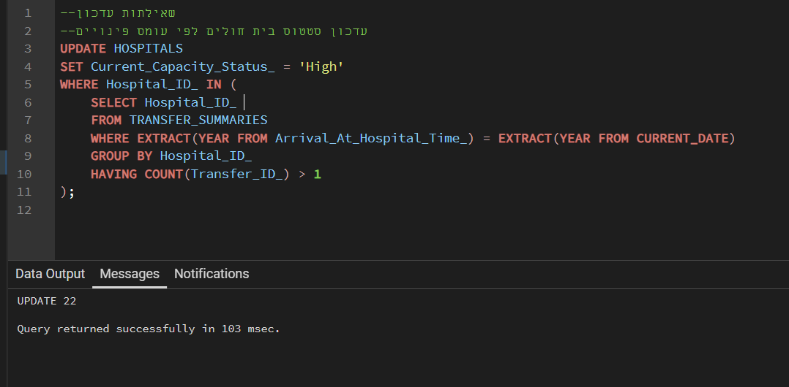


#### UPDATE 2

- **תיאור**: סגירת אירועים ישנים: אירועים בסטטוס `Pending` עם זמן סיום קריאה לא ריק, ושנת תחילת קריאה לפני 2025 — מתעדכנים ל־`Resolved`.
- **שאילתה**:
```sql
UPDATE INCIDENTS
SET Status_ = 'Resolved'
WHERE Status_ = 'Pending' 
  AND Call_End_Timestamp_ IS NOT NULL 
  AND EXTRACT(YEAR FROM Call_Start_Timestamp_) < 2025;
```
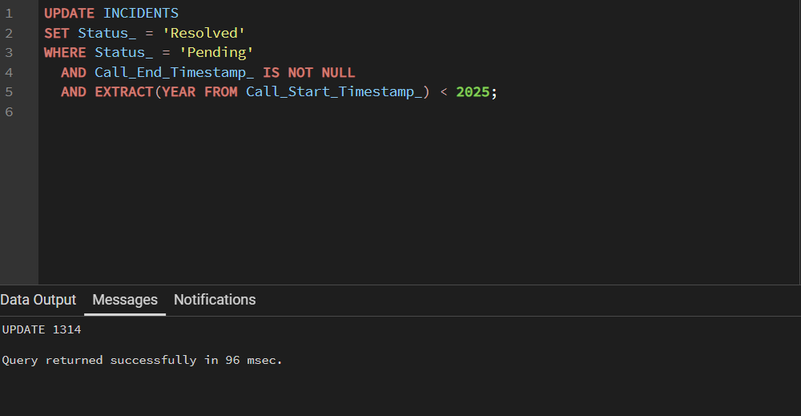

#### UPDATE 3

- **תיאור**: העלאת דרגת עדיפות לסוגי אירוע חמורים: סוג אירוע שעבורו ממוצע חומרה של האירועים גבוה מ־4 — עדיפות ברירת המחדל מתעדכנת ל־1 (הגבוהה ביותר).
- **שאילתה**:
```sql
UPDATE INCIDENT_TYPES
SET Default_Priority_ = 1
WHERE Type_ID_ IN (
    SELECT Type_ID_ 
    FROM INCIDENTS 
    GROUP BY Type_ID_ 
    HAVING AVG(Severity_Level_) > 4
);
```
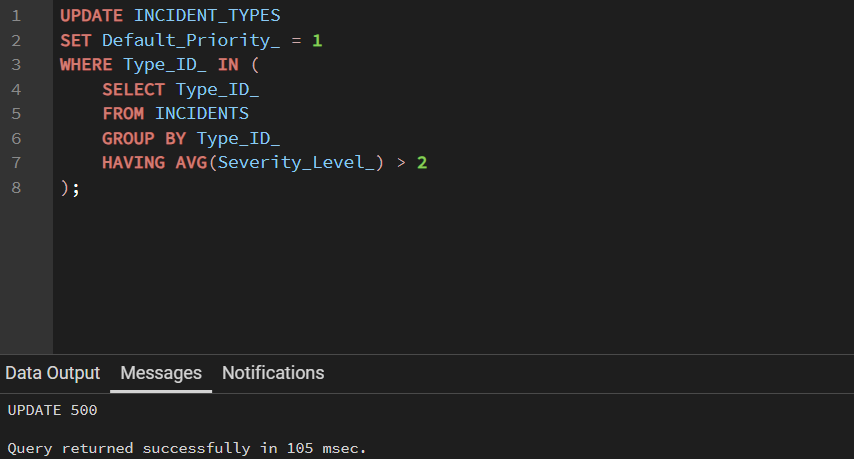


### ROLLBACK ו-COMMIT (הדגמות)

#### הדגמה 1 — עדכון ואז `ROLLBACK`

- **תיאור**: מבצעים עדכון בבסיס הנתונים, מציגים מצב, מבצעים `ROLLBACK`, ומציגים שהמצב חזר לקדמותו.
- **צילום מצב התחלתי (לפני העדכון)**: _(להדביק תמונה כאן)_
- **צילום אחרי העדכון**: _(להדביק תמונה כאן)_
- **צילום אחרי `ROLLBACK`**: _(להדביק תמונה כאן)_

#### הדגמה 2 — עדכון ואז `COMMIT`

- **תיאור**: מבצעים עדכון בבסיס הנתונים, מציגים מצב, מבצעים `COMMIT`, ומציגים שהמצב נשאר כפי שהיה.
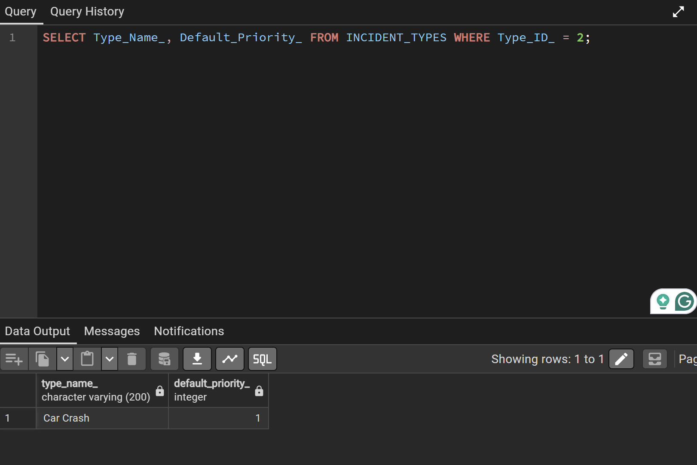
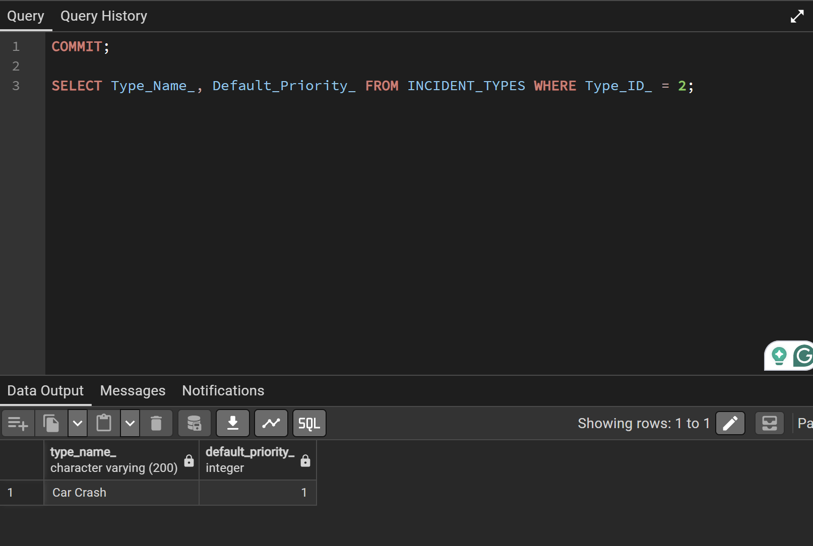


### אילוצים (3 סה״כ) באמצעות `ALTER TABLE`

לכל אילוץ: יש לתאר את השינוי, להציג את פקודת ה-`ALTER TABLE`, לנסות להכניס נתון שסותר את האילוץ, ולהראות שמתקבלת שגיאת הרצה.

#### אילוץ 1

- **תיאור**: הגבלת רמת חומרה בטבלת `INCIDENTS` לטווח 1–5 (שומר על עקביות הערכים במערכת).
- **פקודת `ALTER TABLE`**:
```sql
ALTER TABLE INCIDENTS
ADD CONSTRAINT CHK_Severity_Level CHECK (Severity_Level_ BETWEEN 1 AND 5);
```

#### אילוץ 2

- **תיאור**: וידוא שמספר בית (`House_Num_`) בטבלת `LOCATIONS` חיובי (> 0), למניעת כתובות לא תקינות.
- **פקודת `ALTER TABLE`**:
```sql
ALTER TABLE LOCATIONS
ADD CONSTRAINT CHK_House_Num CHECK (House_Num_ > 0);
```


#### אילוץ 3

- **תיאור**: הגבלת ערכי `Success_Rate_` בטבלת `PROCEDURES_PERFORMED` לערכים מוגדרים בלבד (Enum לוגי).
- **פקודת `ALTER TABLE`**:
```sql
ALTER TABLE PROCEDURES_PERFORMED
ADD CONSTRAINT CHK_Success_Rate_Enum CHECK (Success_Rate_ IN ('High', 'Medium', 'Low', 'Failed'));

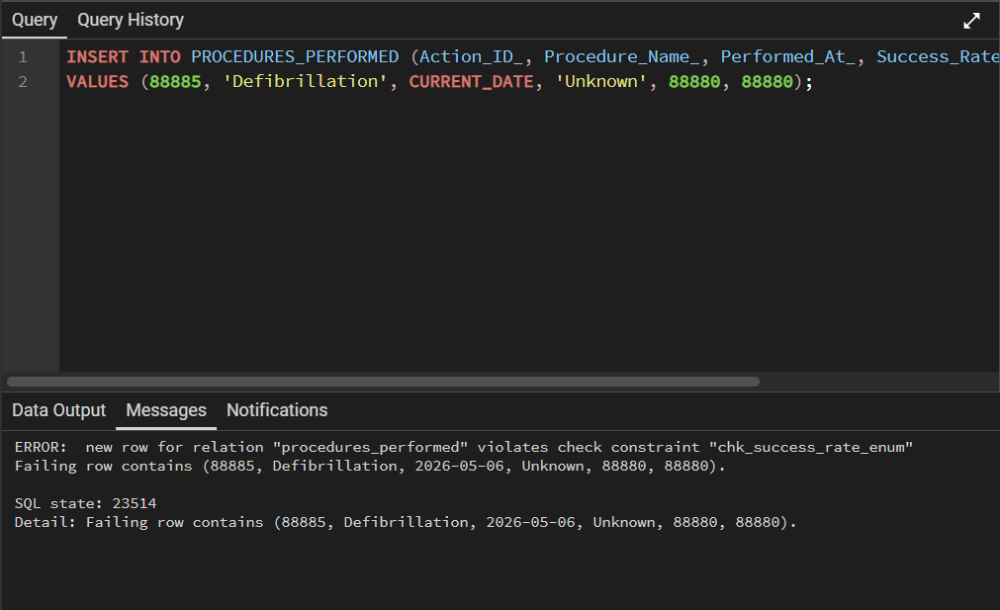


### אינדקסים (3 סה״כ) + בדיקות זמן ריצה

לכל אינדקס: לבדוק זמן ריצה לפני ואחרי הוספת האינדקס, ולהסביר תוצאות.

#### אינדקס 1

- **מוטיבציה/תועלת**: _(להשלים)_
- **בדיקת זמן ריצה לפני**: _(להדביק תמונה כאן)_
- **פקודת יצירת אינדקס**:

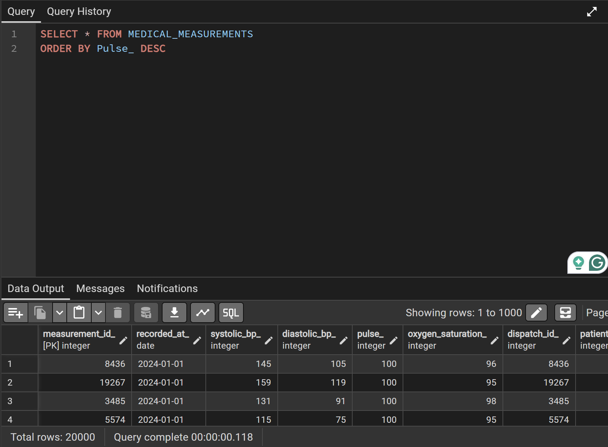
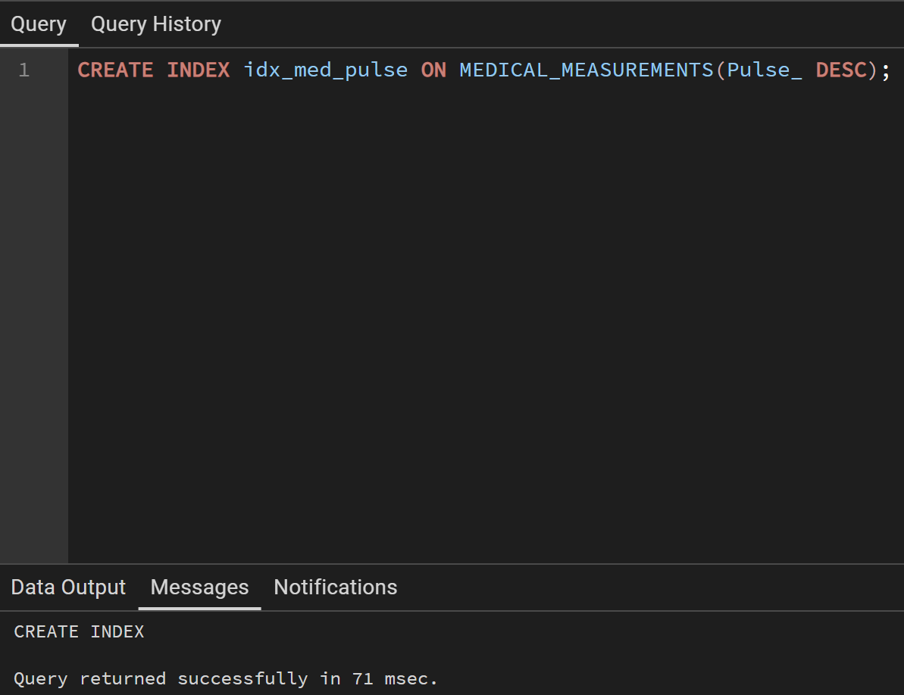
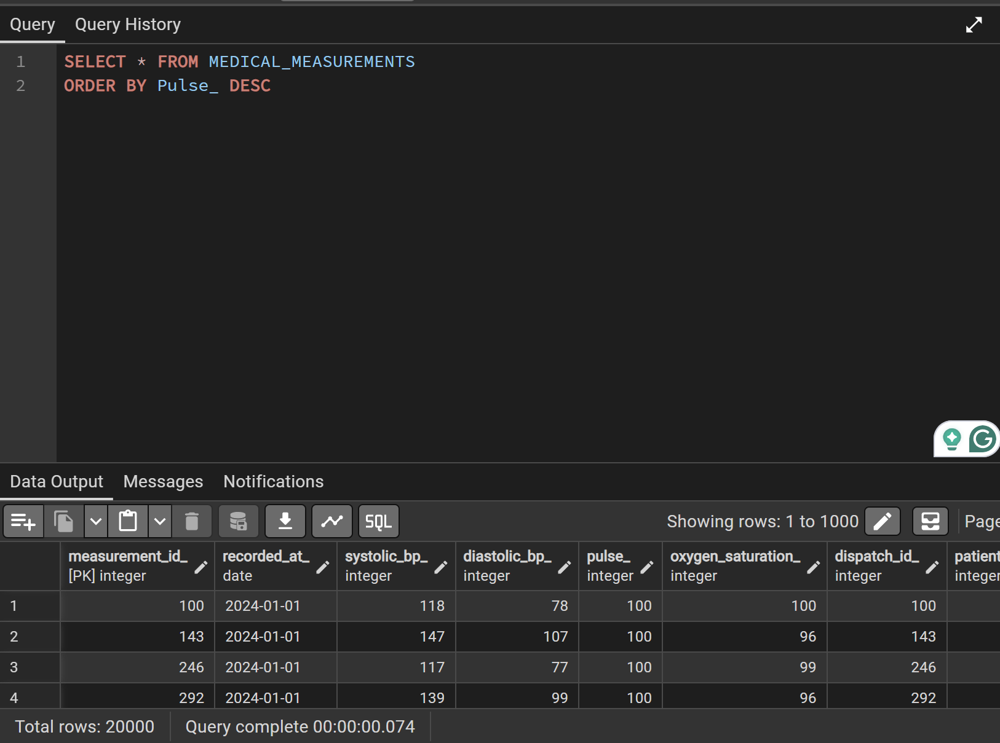


#### אינדקס 2

- **מוטיבציה/תועלת**: _(להשלים)_
- **בדיקת זמן ריצה לפני**: _(להדביק תמונה כאן)_
- **פקודת יצירת אינדקס**:
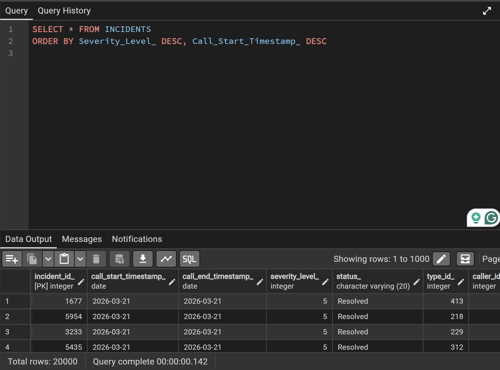
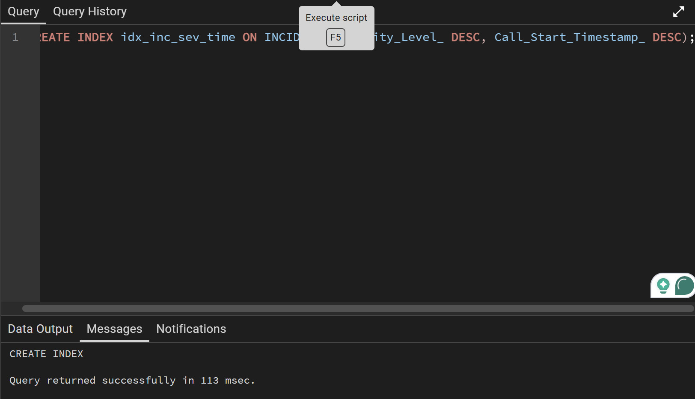
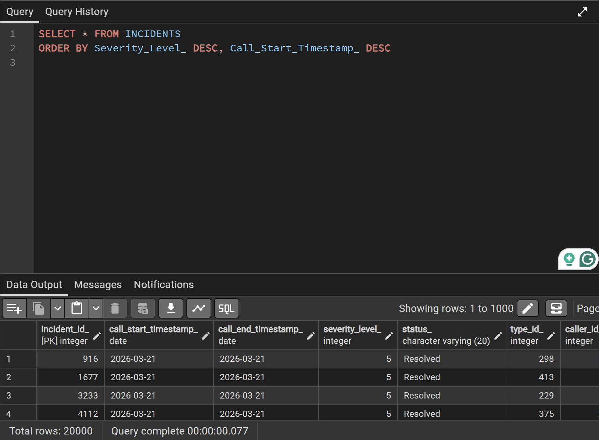

#### אינדקס 3

- **מוטיבציה/תועלת**: _(להשלים)_
- **בדיקת זמן ריצה לפני**: _(להדביק תמונה כאן)_
- **פקודת יצירת אינדקס**:
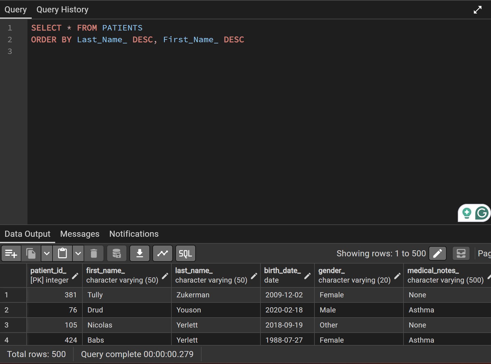
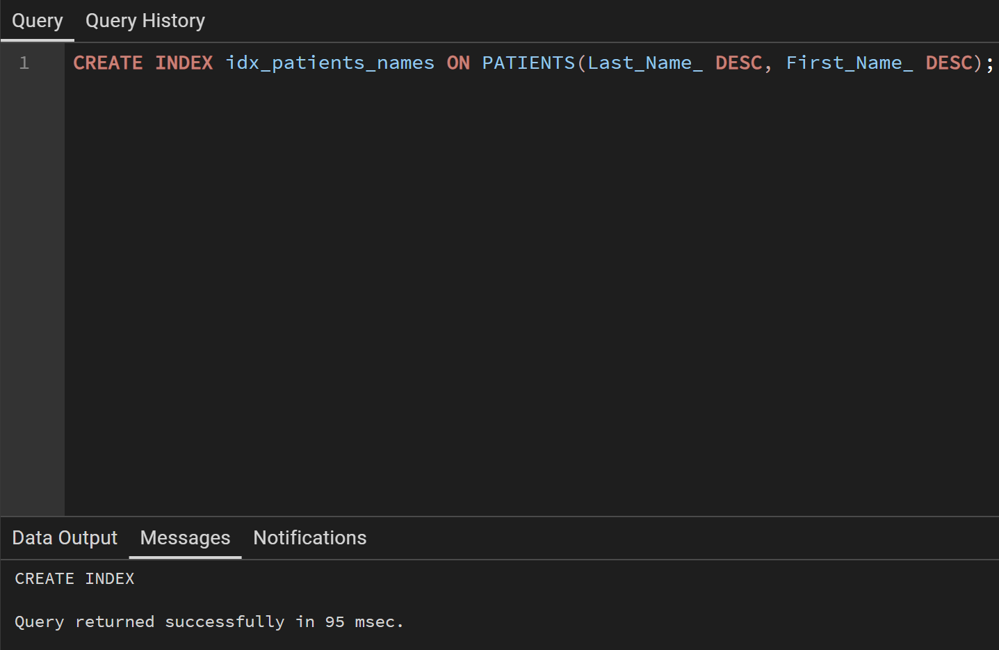
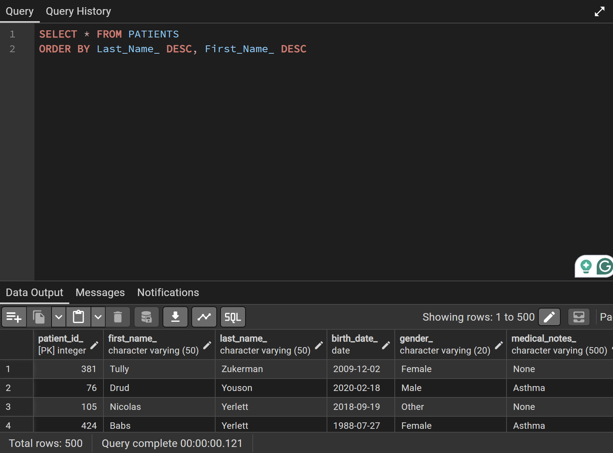
